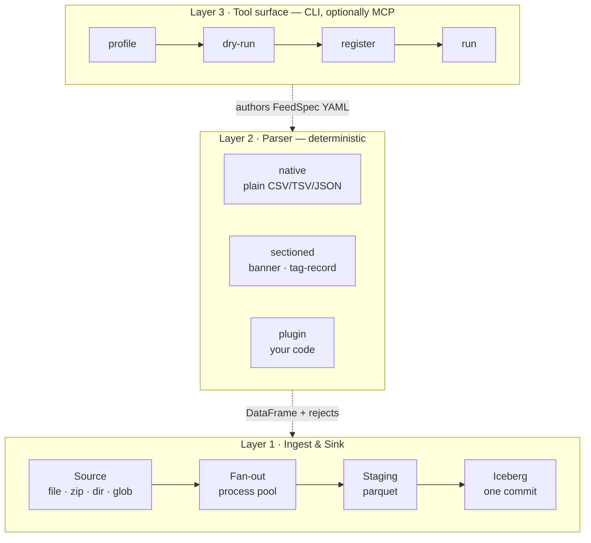

# Flatfile Ingestion Engine

**Status:** v3 — prototype built and passing · **Date:** 2026-08-22 · **Owner:** Abhishek Singh

A framework for landing bespoke flat-file feeds in Iceberg. Engineers write only the
parse logic for their file; the framework owns source resolution, parallelism, staging,
the Iceberg commit, rejects, and lineage.

---

## Thesis

> **The library owns the plumbing. You own the parse function.**

Reference data arrives in formats nobody chose: banner-delimited extracts, tag-per-record
feeds, self-describing headers, one-off vendor conventions. Writing a parser for each is
unavoidable and honestly fine — it's ten minutes of work and the person who knows the feed
should own it.

What isn't fine is that every one of those parsers currently re-invents zip handling,
parallelism, staging, the Iceberg write, reject routing, and lineage columns. That's the
90% that's identical every time, and it's where the bugs live.

So the contract is deliberately small:

```python
def parse(raw: bytes, ctx: ParseContext) -> ParseResult   # you write this
```

Everything else is the framework's problem. Onboarding a new feed is **one YAML file, plus
a parser class only if the built-ins don't already cover it.**

### Corollary: the AI layer is a tool surface, not a runtime

There is no agent in this system, and none is planned. The CLI is designed so that
*someone else's* agent — Claude Code, Copilot, Cursor — can drive it. An engineer hands
their agent a 100-row sample; the agent loops `profile → dry-run → read report → fix
spec`, shows the DataFrame, and the human approves.

An agent is a *client* of the tool, not a layer above it. Building the agent first would
mean building the tool anyway, badly, buried where nothing else could reach it. So the tool
is the product. Two mechanisms carry the instructions an agent would otherwise have to
guess:

- **`ffe new-parser`** generates the blank — plugin, test, and feed spec, correctly shaped.
  An agent fills in a form the engine wrote rather than inventing a contract.
- **`CLAUDE.md`** is the workflow, read automatically when the repo is opened in Claude
  Code. It is the manual you would otherwise repeat by hand every time.

See [Tool surface](#layer-3--tool-surface-for-agents).

---

## Scope

**In:** flat files (text, delimited, fixed-width, sectioned); single files, archives,
directories, globs; parallel processing across archive members; staging Parquet; a single
atomic Iceberg commit per job; reject capture; lineage; a job ledger.

**Explicitly out** — each of these is a deliberate cut, not an oversight:

| Non-goal | Why | Cost if it changes |
|---|---|---|
| Silver / marts | This library stops at bronze. Downstream is dbt's job. | none — additive |
| Multiple data record types per file | **Assumption: one file = one pattern = one DataFrame.** Header/footer/meta records are fine; two *different* data schemas in one file are not. | `ParseResult` shape change, touches every layer — so revisit before Phase 2, not after |
| Parent-child record hierarchy | Follows from the above. No "current parent" cursor. | structure stage becomes stateful |
| Streaming a single huge member | Every member is assumed to fit in memory. True for "2 GB zip of many smaller files". | chunked framer, block state across boundaries — roughly doubles parser complexity |
| Our own agent runtime | Superseded by the tool surface. Any coding agent is a client. | — |
| Generated parser code | If the declarative spec can't express a file, a human (or their agent, in their editor) writes the plugin. | — |
| Partitioned Iceberg tables | Prototype commits unpartitioned. `add_files` on a partitioned table needs partition-aware staging splits. | contained: staging + sink only |

---

## Architecture



Two subpackages and a CLI. No AI dependency anywhere in the install.

| Package | Depends on |
|---|---|
| `ffe.core` — parsers, spec models, report | polars, pydantic |
| `ffe.io` — source, runner, staging, ledger, sink | `ffe.core`, pyarrow, pyiceberg |
| `ffe.cli` — the agent-facing surface | both, typer |

The rule that matters: **`ffe.core` has no I/O and no config discovery.** `parse(spec, bytes)`
is a pure function. That's what makes it testable, and it's what lets `dry-run` be safe by
construction rather than by care — not by remembering to be careful.

---

## Measured, not assumed

Numbers from the prototype on this machine (M-series, 10 cores, Polars 1.43,
Python 3.12). They changed two design decisions, so they belong in the document.

**Parsing is not the bottleneck you would expect.** For one 150k-row tag-record member:

| Stage | Time | Share |
|---|---|---|
| framing bytes → lines | 26.4 ms | 41% |
| structure detection | 32.2 ms | 50% |
| join to buffer | 2.7 ms | 4% |
| line-number series | 1.4 ms | 2% |
| **Polars `read_csv`** | **1.2 ms** | **2%** |

The actual parse was 2% of the time. The other 98% was Python allocating one object per
line. Removing that — plain `list[str]`, line numbers as index offsets, `str.count` instead
of `str.split` for widths — took throughput from **1.6M to 5.2M rows/s single-threaded**.
The design already said "never parse rows in Python"; the first implementation violated it
one level up, at *lines* rather than fields. Worth stating as a rule because it is not
obvious: an object per line is nearly as bad as parsing fields by hand.

**Parallelism earns much less than expected at small scale.** Same job, three executors:

| Workload | serial | thread | process |
|---|---|---|---|
| 120 members, 360k rows, deflated | 0.93 s | **0.85 s** | 1.15 s |
| 8 members, 1.2M rows | 0.63 s | **0.59 s** | 0.97 s |
| 24 members, 960k rows, Python-loop plugin | 0.85 s | **0.83 s** | 1.11 s |

Processes lose *every* time. The reason is arithmetic: total parse work in these jobs is
0.4–0.8 s, while spawning 8 processes that each re-import Polars costs ~0.5 s. Even a
plugin looping rows in Python managed 2.1M rows/s, so it never became GIL-bound enough to
pay for the pool.

Consequences, adopted:

- **Default executor is `thread`.** It is free — no spawn, no re-import — and wins slightly
  because zip inflate and Polars both release the GIL.
- **`process` is opt-in**, worth it only once aggregate parse time is well past the ~0.5 s
  pool-startup cost. That means roughly **4M+ rows per job**, which is about where a 2 GB
  archive lands. So the fan-out design is right for the target workload and pure overhead
  for the toy sizes it is tempting to benchmark with.
- **Never assume the parallel path is the fast path.** `--executor serial` is a legitimate
  production choice and the easiest thing to debug.

---

## The FeedSpec

One YAML file per feed. It binds *where files come from* → *how to parse them* → *where
they land*. This is the artifact an engineer commits, and the artifact an agent produces.

```yaml
name: issue-reference
source:
  pattern: "s3://drop/issues/*.zip"       # or a local glob
  members: "*/issue_*.txt"                # which entries inside the archive
parser:
  kind: sectioned                          # native | sectioned | plugin
  ...                                      # see worked examples
target:
  table: bronze.issues
policy:
  on_reject: quarantine                    # quarantine | fail
  max_reject_ratio: 0.01                   # exceeded → job fails, nothing commits
  workers: 8
```

`ffe schema` prints the full accepted shape, generated from the pydantic models — so it
cannot drift from what the code actually accepts.

A plugin-based feed differs only in the `parser` block:

```yaml
parser:
  kind: plugin
  ref: acme-positions
  options: { amount_scale: 100 }
```

Specs live in `feeds/` in git. Reviewable, diffable, versioned — that's the whole point of
config over code. `parser.kind: plugin` still needs a spec entry, so there is exactly one
place to look to understand any feed.

---

## Layer 2 — parsers

### The plugin SPI is the primary path

```python
from ffe.core.plugins import register, ParserPlugin, ParseContext
from ffe.core.report import ParseResult

@register("acme-positions")
class AcmePositions(ParserPlugin):
    def parse(self, raw: bytes, ctx: ParseContext) -> ParseResult:
        ...
        return ParseResult(frame=df, rejects=bad, report=rep)
```

`ctx` carries the resolved options, member name, and job id. Plugins are discovered from a
configured directory and from `ffe.parsers` entry points.

What a plugin author gets for free, and must not implement: zip member resolution,
parallelism, staging writes, Arrow schema alignment, the Iceberg commit, lineage columns,
ledger rows, retries. What they must provide: a DataFrame, optionally a reject frame, and
row counts.

`ffe new-parser <ref>` scaffolds the plugin, its test, and its feed spec, all correctly
shaped — so neither a human nor an agent has to infer the contract.

Fixed-width is deliberately *not* a built-in strategy, which makes it the honest reference
example of this path: `plugins/acme_positions.py`.

### Built-in: `native`

Well-formed CSV/TSV/JSON/NDJSON/Parquet. Delegates wholesale to `pl.read_csv` /
`pl.scan_csv`. Four lines of spec, no code, and fast — Python never touches a row. This is
the path for feeds that are just files.

### Built-in: `sectioned`

Files with regions — banners, header blocks, record tags, trailers. Five stages:

| Stage | Variants |
|---|---|
| **Framer** `bytes → Lines` | encoding (utf-8, latin-1, cp1252, cp037), BOM, CRLF/LF/CR, trailing-blank trim |
| **Structure** `Lines → FileLayout` | `sentinel`, `record_tag`, `fixed_offset` — **pluggable** |
| **Header** `Block → Schema` | `ddl`, `name_row`, `copybook`, `supplied`, `infer` — **pluggable** |
| **Data** `Block, Schema → DataFrame` | `delimited`, `fixed_width` |
| **Coerce** | cast policy, trim, null tokens, reject routing |

Only Structure and Header are pluggable by name. Framer and Coerce barely vary across real
feeds; making them extensible before something demands it is ceremony. If a feed needs a
custom framer, that feed wants `kind: plugin`.

### Two rules that decide whether this is fast or a toy

**Never parse rows in Python.** Structure detection finds *byte boundaries*; the data stage
slices the original buffer and hands it to Polars' Rust CSV reader.

```python
chunk = raw[block.byte_start : block.byte_end]
df = pl.read_csv(io.BytesIO(chunk), separator=spec.data.delimiter,
                 has_header=False, schema=schema.to_polars(),
                 truncate_ragged_lines=True)
```

Python touches O(lines) bytes for boundaries, O(1) rows for parsing. For `record_tag` files
where data lines are interleaved, concatenate the data lines into one buffer in a single
pass, then one `read_csv`.

**Coerce never raises.** Cast with `strict=False`, diff the null mask before and after,
route newly-null rows into `rejects` with a reason. One bad date in row 3,000,000 must not
kill the job.

### Lineage, always

```
_src_file  utf8   ·  _src_line_no  uint32  ·  _job_id  utf8
_parser    utf8   ·  _spec_hash    utf8    ·  _ingested_at  timestamp
```

`_src_line_no` is the one that pays for itself. Without it, "row 812 of the reject table is
malformed" is unactionable.

### Schema: supplied, from header, or inferred once

`infer` is a **spec-authoring aid, not a runtime behaviour.** On the first successful run
the inferred schema is frozen into the spec and the mode flips to `supplied`. Live
inference on every run is how a column silently becomes `utf8` next quarter.

---

## Worked example A — banner-delimited, self-describing header

```
*
*
*
Header

name string(100)
age  int(10)
*
ABhishek,10
ANkita,20,
Nilanjana,30
*
END
```

Three things make it interesting: `*` is both section delimiter *and* leading noise; the
header is a mini-DDL rather than a column row; `ANkita,20,` is ragged.

```yaml
parser:
  kind: sectioned
  framer: { encoding: utf-8, newline: auto, strip_trailing_blank: true }
  structure:
    strategy: sentinel
    sentinel: "*"
    collapse_runs: true          # three leading * = one boundary, not three blocks
    blocks:
      - { kind: header,  ordinal: 0, skip_leading: 1, drop_blank: true }   # drops "Header"
      - { kind: data,    ordinal: 1 }
      - { kind: trailer, ordinal: 2, optional: true }
  header:
    parser: ddl
    pattern: '^(?P<name>\S+)\s+(?P<type>\w+)\((?P<width>\d+)\)$'
    type_map: { string: utf8, int: int64, dec: decimal }
  data:
    parser: delimited
    delimiter: ","
    trailing_delimiter: tolerate
    ragged: truncate
  coerce: { on_error: reject, trim: true, empty_as_null: true }
  validate: { trailer_token: END }
```

→ `[name: utf8, age: int64]`, 3 rows, 0 rejects. The DDL `width` is kept as schema
metadata — it drives fixed-width variants and length checks, but doesn't truncate.

## Worked example B — tag-per-record

```
F|issue.1|20260608
H|20260608|issue|id|name
I|1|Abhishek
I|2|Nilanjana
E|issue
```

Structure is vertical: field 0 names the record type, so it's per-line dispatch, not
regions. Exactly one record type is data (`I`) — per the scope assumption.

```yaml
parser:
  kind: sectioned
  structure:
    strategy: record_tag
    delimiter: "|"
    tag_position: 0
    records:
      F: { kind: file_header, fields: [tag, file_id, business_date] }
      H: { kind: header }
      I: { kind: data }
      E: { kind: trailer, fields: [tag, entity] }
    unknown_tag: reject
  header:
    parser: name_row
    skip_leading_fields: 3       # skip H | 20260608 | issue  →  names are id, name
    names_from: remainder
  data:
    parser: delimited
    delimiter: "|"
    drop_columns: [tag]          # strip the I so widths align
  coerce:
    schema_override: { id: int64, name: utf8 }
    on_error: reject
  validate:
    require_trailer: true
    promote_fields: [business_date, file_id]   # lift F-record values onto every data row
```

→ `[id: int64, name: utf8, business_date: date, file_id: utf8]`, 2 rows.

`promote_fields` is easy to forget and always wanted: the business date lives in the file
header, and every downstream query needs it on the row.

---

## Layer 1 — ingest and sink

### Source

`Source` resolves a URI into `Member(name, size, open() -> BinaryIO)`. The caller writes
`ffe run issue-reference` and never learns whether it was a file or an archive.

| Source | Members |
|---|---|
| `FileSource` | 1 |
| `ArchiveSource` (zip, tar, tar.gz) | N |
| `CompressedFileSource` (.gz, .bz2, .zst) | 1, transparently decompressed |
| `DirSource` / `GlobSource` | N |

Two archive rules learned the hard way: **each worker opens its own `ZipFile` handle** —
per-member random access is safe, a shared streaming handle is not — and nested archives
are followed to a bounded depth, default 1.

### Parallel fan-out, single commit

`ProcessPoolExecutor` over members. Each worker parses independently and writes
`staging/{job_id}/{dataset}/part-{idx}.parquet` plus a reject sibling. **No worker touches
Iceberg.** When all workers finish, one single-threaded commit groups staged files by target
table and calls `table.add_files([...])` once per table.

`add_files` registers existing Parquet without rewriting it — it reads the footers for
statistics. One snapshot per job, no concurrent commits, no retry storms.

Three constraints fall out, all handled at staging-write time rather than discovered in
production:

1. **One staged file → exactly one partition.** Partitioning on `_ingest_date` satisfies
   this naturally, since a job is one ingest date.
2. **Parquet schema must match the Iceberg schema.** Cast to an Arrow schema derived from
   the *live* Iceberg table before writing staging — not after.
3. **New columns are a decision, not an accident.** `policy.schema_change: fail` by default.

Fallback if `add_files` proves sharp-edged: single-threaded `table.append()` over the same
staged files. Slower, but the staging boundary makes it a contained swap — as does
replacing the commit step with Spark, Daft, or DuckDB. **Iceberg stays at the boundary;
everything upstream is Parquet.** Deliberate insulation against pyiceberg's write-path
maturity.

### Layers

| Layer | Store | Contents |
|---|---|---|
| **L0 landing** | object store | archives byte-identical, immutable — enables replay |
| **L1 staging** | Parquet | per-member good + reject, with the resolved spec and report as sidecars |
| **L2 bronze** | Iceberg | append-only, source-faithful types, partitioned by `_ingest_date` |
| **rejects** | Iceberg | its own table, same rigour — not a log file |

No silver. Downstream is dbt's problem.

### Job ledger

SQLite locally, Postgres later. One row per `(job_id, member)`: status, parser, spec hash,
staged path, rows in / parsed / rejected, duration, error. This is what makes idempotent
retries and "did file X land?" answerable. Not optional.

### ParseReport

One object, three readers — the ledger, the human, and whatever agent is driving `dry-run`.
Deliberately not three metric paths.

```
lines_total, lines_consumed, rows_parsed, rows_rejected
columns[]  { name, dtype, null_count, cast_failures }
ragged_lines, unknown_tags
trailer_declared_rows  vs  rows_parsed
spec_hash, parser, engine_version, duration_ms
```

`trailer_declared_rows` matters more than it looks. Both worked examples end with a
terminator record, and many real feeds declare a row count there — free, exact validation.
Treat a mismatch as a hard failure, not a warning.

---

## Layer 3 — tool surface for agents

Six verbs. Every one emits JSON. This is the whole AI story.

| Verb | Does | Writes anything? |
|---|---|---|
| `ffe profile <sample>` | deterministic structural profile — no model involved | no |
| `ffe dry-run <sample> --spec <f>` | parse a sample, return report + `head(20)` + schema | **no, by construction** |
| `ffe lint <spec>` | validate the spec against the schema, without a file | no |
| `ffe register <spec>` | write to `feeds/`, create or verify the Iceberg table | yes |
| `ffe run <feed>` | the real ingestion | yes |
| `ffe explain <feed>` | resolved config, target table, last N job outcomes | no |

The loop an engineer's agent runs, all shell:

```
profile sample.txt  →  author spec  →  dry-run  →  read report
    ↳ gates fail? adjust spec, dry-run again (agent iterates)
    ↳ gates pass? show the DataFrame to the human  →  register
```

Sample files are capped at **100 rows** on upload. That is enough to determine structure
and small enough to sit in a context window alongside the profile and the report.

### The profile

Deterministic. No model. **Code measures; the model only interprets.**

- first 60 lines, last 20, one middle window
- line-length histogram
- candidate-delimiter frequency per line (`, | ; \t ~ ^`)
- **token frequency at position 0** — this is what reveals `F`/`H`/`I`/`E`
- repeated single-character lines — this is what reveals `*` banners
- encoding guess with confidence, line count, byte size

Delimiter counts and offsets come from arithmetic. The interpretive leap — "position 0 is a
record tag, `H` is the header, `E` is the trailer" — is the only part a model does, and it
is handed the measurements rather than asked to produce them.

### Designing errors for a model reader

The single highest-leverage decision in this whole document. An agent's next action is
determined entirely by what the last command printed, so **an error message must name the
spec field to change and offer measured alternatives.**

```json
{
  "error": "column_count_unstable",
  "field": "parser.data.delimiter",
  "observed": { ",": {"cols": 1, "consistent_lines": 47} },
  "candidates": [ { "value": "|", "cols": 5, "consistent_lines": 50 } ],
  "hint": "Set parser.data.delimiter to \"|\"."
}
```

That error *is* the prompt. Get this right and any competent agent converges in one or two
iterations with no prompt engineering on our side. Get it wrong and no amount of prompting
rescues it.

The rest of the contract:

1. `--json` on every verb, with a stable documented schema. Never pretty-print-only.
2. Exit codes separate *spec is wrong* (2) from *file is wrong* (3) from *we crashed* (1).
   An agent must be able to tell "fix your spec" from "this file is broken".
3. `dry-run` cannot write. Enforced by `ffe_core` having no I/O, not by discipline.
4. No hidden state between invocations. Every verb idempotent.
5. Bounded output — `head(20)`, values truncated at 200 chars — so results fit a context
   window without truncation surprises.

### MCP, later and thin

If this should be drivable from Copilot or Cursor rather than a shell, wrap the same six
verbs as MCP tools. One thin adapter, no second implementation. Not needed for Claude Code,
which already has a shell.

---

## Repo layout

```
polars-parser-agent/
├── pyproject.toml              # ffe; [dev] extra. python 3.12
├── CLAUDE.md                   # the workflow, written for an agent to follow
├── README.md
├── docs/DESIGN.md
├── src/ffe/
│   ├── core/                   # pure. no I/O anywhere in here.
│   │   ├── spec.py             # FeedSpec + discriminated parser union
│   │   ├── framer.py           # bytes -> Lines (list[str] + base offset)
│   │   ├── structure.py        # sentinel + record_tag -> index regions
│   │   ├── header.py           # ddl | name_row | supplied -> Schema
│   │   ├── coerce.py           # cast, and route failures to rejects
│   │   ├── engine.py           # parse(spec, bytes) -> ParseResult
│   │   ├── profile.py          # deterministic structural profile
│   │   ├── plugins.py          # the SPI + registry + load_dir
│   │   └── report.py           # ParseReport, ParseResult, ParseError
│   ├── io/
│   │   ├── source.py           # file | zip | dir | glob -> Member
│   │   ├── runner.py           # fan-out, gates, then one commit
│   │   ├── staging.py          # parquet + lineage columns
│   │   ├── sink.py             # Iceberg add_files
│   │   └── ledger.py           # sqlite job/member history
│   ├── scaffold.py             # ffe new-parser
│   └── cli.py                  # the seven verbs
├── feeds/                      # FeedSpec YAML -- versioned config
│   ├── banner-ddl-feed.yaml    # worked example A
│   ├── pipe-tagged-feed.yaml   # worked example B
│   └── msci-test.yaml          # the runbook's worked example
├── plugins/
│   └── acme_positions.py       # fixed-width; the reference plugin
└── tests/
    ├── test_engine.py          # 12 tests: both examples, rejects, error payloads
    ├── test_native_and_plugins.py
    ├── test_pipeline.py        # zip fan-out, one snapshot, gates, ledger
    └── fixtures/               # every sample, pinned by a test
```

`ffe.core` importing nothing from `ffe.io` is what makes `dry-run` unable to write. It is a
structural guarantee, not a convention.

Local stack runs with **no services**: pyiceberg SQLite catalog, filesystem warehouse,
SQLite ledger. Docker Compose (MinIO + Iceberg REST + Postgres) is a later swap behind the
same interfaces.

## Build status

| Phase | Deliverable | State |
|---|---|---|
| **0** | Skeleton, `FeedSpec` models, both examples as fixtures | **done** |
| **1** | Engine: native + sectioned + plugin SPI + `ParseReport` | **done** — 16 tests |
| **2** | Source, zip fan-out, staging, ledger, `add_files` commit | **done** — 12 tests |
| **3** | Seven CLI verbs, JSON output, structured errors, `CLAUDE.md` | **done** |
| **4** | Partitioned tables, schema evolution, fixed-width built-in | not started |
| **5** | Docker Compose, MinIO, REST catalog, S3 sources | not started |

`pytest` — 28 passing in 0.85 s. Verified end to end: a 40-member zip fans out and lands
1,639 rows in **one** Iceberg snapshot with full lineage on every row; the reject-ratio gate
refuses to commit a feed with 20% bad rows; all three executors produce identical results.

What the prototype deliberately does *not* do yet, in the order I would add it:

1. **Partitioned tables.** Commits are unpartitioned. Partitioning on `_ingest_date` needs
   partition-aware staging splits so one file maps to one partition.
2. **Fixed-width as a built-in.** Currently a plugin. Real reference data will want it
   declaratively, and it is the obvious third structure strategy.
3. **Schema drift detection.** `add_files` refuses mismatched staged schemas with a clear
   error, but there is no policy yet for "a new column appeared".
4. **Object-store sources.** `source.py` handles local paths only; S3 is an interface swap.

## Risks

**pyiceberg write maturity.** Mitigated structurally and now confirmed by the build:
Iceberg is touched only by `sink.py`, ~40 lines. `add_files` worked first try for
unpartitioned tables; partitioned is the untested part. Swapping the commit engine for
Spark/Daft/DuckDB stays a one-file change.

**Sample-vs-production drift.** A 100-row sample cannot show the one row in 4 million with
an embedded delimiter. Accepted knowingly. The net is the reject table plus
`max_reject_ratio`, which fails the job rather than landing 99.9%. The loop back is
ordinary engineering: query `<table>_rejects` for the failing rows, hand them to whoever
wrote the parser, tighten it, add the shape to the fixture.

**Plugin sprawl.** If plugins are the primary path, in two years there are 200 with no
shared conventions. Mitigated by `new-parser` emitting the same shape every time and by the
contract being stated in `CLAUDE.md` where an agent will actually read it.

**Over-trusting the parallel path.** Measured above: processes lost every benchmark. The
risk is someone assuming `--executor process` is the fast setting and burning half a second
of spawn cost per job. Default is `thread`; `serial` is a legitimate production choice.

**Example A stays ambiguous** — `*` is delimiter *and* leading noise. It is a permanent
fixture with a dedicated test asserting the three leading sentinels collapse to one
boundary.

## Open questions

Everything blocking is now answered by the prototype. What's left is genuinely yours:

1. **Is `max_reject_ratio: 0.01` the right default?** Currently a non-empty reject table
   does *not* block the commit — only exceeding the ratio does, and then nothing commits at
   all. That felt right building it; it is a policy call.
2. **Fixed-width: promote to a built-in strategy, or leave it as the reference plugin?**
   The plugin works and is arguably clearer. Depends how many feeds need it.
3. **Plugin distribution** — in-repo `plugins/`, or pip packages declaring `ffe.parsers`
   entry points? Only matters once another team authors feeds.
4. **Who owns the Iceberg table DDL** — `ffe run` creates tables on first commit, which is
   convenient and slightly too magical for production. Split into an explicit
   `ffe register` step?
5. **Does `promote_fields` belong in bronze at all?** It lifts the business date onto every
   row as text. Source-faithful, but it is a transform, and bronze arguably shouldn't do
   transforms.
